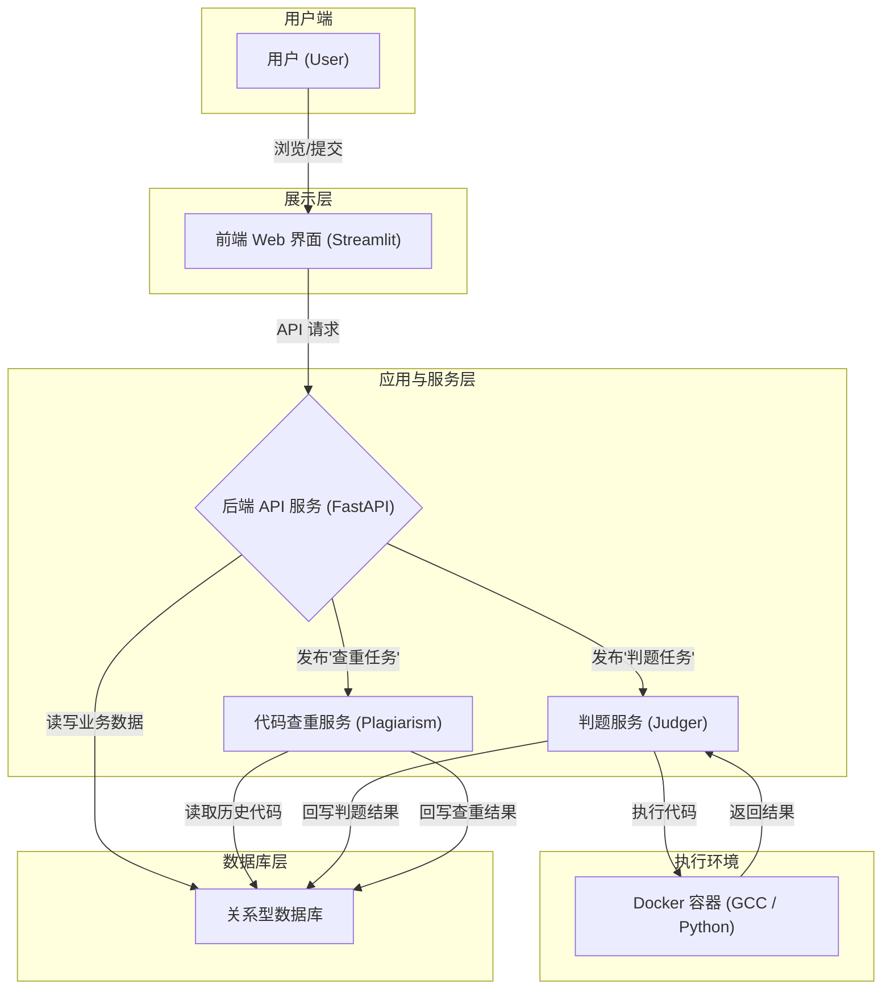

## 在线评测系统(OJ)实验报告

王鹏杰 2024010860 计48-经42

### 1. 系统功能与设计

#### 1.1 模块组成和系统架构

主要组成模块包括:

- **前端:** 基于 `Streamlit` 构建前端界面. 用户通过浏览器与前端交互, 进行题目浏览、代码提交、查看评测结果等操作. 前端通过调用后端提供的 API 来完成业务逻辑.
- **后端:** 基于 `FastAPI` 构建API服务. 这是整个系统的核心, 负责处理业务逻辑, 包括用户认证、题目管理、提交处理等.
- **数据库:** 使用 `SQLAlchemy` 作为数据库管理工具, 负责存储和管理所有数据, 例如用户信息、题目、提交记录等; 还可以进行数据持久化相关操作.
- **评测模块:** 负责编译和运行用户提交的代码, 基于 `Docker` 容器实现, 为每次评测提供一个隔离、安全、资源受限的沙箱环境, 保证了评测过程的安全性; 同时使用线程池进行并行评测, 不阻塞后端交互.
- **查重模块:** 基于PDG进行查重任务, 从代码的语义结构层面分析相似性.

系统整体架构与数据流可以用下图表示:



#### 1.2 系统主要功能

1. 用户管理

系统提供了完善的用户角色与权限管理机制.

- 注册与登录: 普通用户可以注册账号, 并通过安全的登录验证 (基于Session实现) 进入系统.
- 权限管理: 系统内置了三种角色: 普通用户, 管理员, 被封禁用户. 普通用户可以提交代码、查看自己的提交历史和题目列表; 管理员可以查看所有人的提交, 并可以执行删除、数据导入导出等高风险操作; 被封禁用户会被禁止登录, 并被禁止提交.

2. 题目管理

- 增删改查: 可以导入新题目, 包括题目标题、内容描述、输入输出格式、样例等. 同时也可以对现有题目删除, 或者设置judge mode等信息.
- 语言管理: 提供了语言的添加接口, 可以动态添加语言, 设置语言的评测策略.
- spj管理: 设置了题目standard, strict, spj三种评测模式; 其中spj模式支持设置spj脚本进行评测, 细颗粒度处理测试点得分.

3. 日志管理和数据持久化

- 日志管理: 记录了评测日志, 权限变化日志, 可以进行访问.
- 数据持久化: 如系统重置, 数据导入, 数据导出.

4. 在线评测

- 代码提交: 用户可以针对特定题目, 选择编程语言 (如 C++, Python) 并提交代码.
- 异步判题: 后端接收到提交后, 会创建一个判题任务并放入队列, 然后由评测机异步处理, 避免了长时间的HTTP请求阻塞.
- docker执行: 判题机利用 Docker 技术, 为每一次提交动态创建一个隔离的容器环境. 防止恶意代码破坏评测机系统, 并能精确地限制代码运行的CPU时间和内存使用, 实现对TLE和MLE的判断.
- 结果反馈: 判题结束后, 结果 (如 Accepted, Wrong Answer, Compile Error 等) 会被记录到数据库, 并通过前端界面实时反馈给用户.

5. 代码查重

系统利用 PDG 来分析代码的内在逻辑和结构, 这使得它能够识别出那些通过修改变量名、调整语序等方式进行伪装的抄袭代码. 管理员可以针对提交发起查重任务. 系统会计算相似度, 并列出相似度最高的前五名, 以及相似度最高的一对代码的相似摘要.

6. 安全系统

- 语言层面: 对上传语言的run cmd, compile cmd执行严格校验, 只允许白名单中的前缀出现, 并且不得包含黑名单中的任何指令.
- docker层面: 编译和运行均赋予 `nobody` 身份, 禁止网络连接, 设置内存上限, 运行时设置只读模式, 严格保证评测安全.
- 用户密码层面: 将用户密码hash后存储, 以此为依据校验, 避免用户信息泄漏.

#### 1.3 技术选型

整体上, 我们采用了一个前后端分离的框架:

- 后端 API 服务: 位于 app/ 目录, 负责核心业务逻辑, 包括用户认证, 题目管理, 代码提交与判题等.
- 前端 Web 界面: 位于 frontend/ 目录, 为用户提供交互界面.

各模块技术选型

1. 后端 (`app/ 目录`)

- Web 框架: 使用了 FastAPI 框架.
    - app/api/: 存放各个路由模块 (如 users.py, problems.py)
    - app/schemas/: 使用Pydantic框架, 存放数据校验模型 (如 user.py, problem.py), 用于数据验证和序列化.

- 数据库: `app/db/`
    - models.py: 这个文件通常用于定义数据表模型
    - database.py: 包含了数据库连接和会话管理的配置.

- 代码评测模块 (`judger/`): 使用了`multiprocessing`和`concurrent.futures.ProcessPoolExecutor`的并行模型, docker的沙箱模型

- 代码查重模块 (`plagiarism/`): 使用了 ast -> cfg -> pdg的技术

2. 前端 (`frontend`)
    - Web 框架: 使用了Streamlit 框架, 快速构建数据科学和内部工具类的 Web 应用, 每个 .py文件对应一个页面.
    - API 客户端: `frontend/api/api_client.py` 文件封装了与后端FastAPI 服务进行 HTTP 通信的客户端.

<div STYLE="page-break-after: always;"></div>

### 2. 核心技术与实现细节

#### 2.1 数据库

数据库是本在线评测系统的核心, 承载了所有用户数据、题目信息和提交记录, 是所有后端模块交互的中心. 项目采用 **SQLAlchemy** 作为ORM工具, 实现了业务逻辑与数据库的解耦.

##### 核心模型与关系

在 `app/db/models.py` 中, 我们定义了系统的核心数据模型, 包括 `UserModel`, `ProblemModel`, `SubmissionModel`, `LanguageModel` 等. 每个模型类都精确映射到数据库中的一张表. 为了管理题目与测试点、样例之间的从属关系, 我们还定义了 `CaseModel` 和 `SampleModel` 等关联模型.

SQLAlchemy 的 `relationship` 功能被广泛用于定义模型间的关联, 例如 "一对多" 或 "多对一". 这使得数据查询和关联操作变得直观.

**代码示例: `app/db/models.py` 中的 `ProblemModel`**
```python
class ProblemModel(Base):
    __tablename__ = "problems"
    id = Column(Integer, primary_key=True, autoincrement=True)
    problem_id = Column(String(255), index=True, nullable=False, unique=True)
    # ... 其他字段

    # Relationships
    submissions = relationship("SubmissionModel", back_populates="problem")
    samples = relationship("SampleModel", back_populates="problem", cascade="all, delete-orphan")
    testcases = relationship("CaseModel", back_populates="problem", cascade="all, delete-orphan")
```

##### 设计与实现难点

1.  **级联删除与外键约束:**
    在 OJ 系统中, 删除一个实体 (如 `ProblemModel`) 时, 必须确保其所有关联的从属数据 (如 `CaseModel`, `SampleModel`) 也被一并清除, 以维护数据一致性.
    
    - **解决方案:** 我们在 `relationship` 中配置了 `cascade="all, delete-orphan"` 选项. 这使得当一个 `ProblemModel` 实例被删除时, SQLAlchemy 会自动删除所有与之关联的 `SampleModel` 和 `CaseModel` 实例.
    - **关键配置:** SQLite 默认不强制开启外键约束, 这可能导致级联删除失效. 为解决此问题, 我们在 `app/db/database.py` 中通过 SQLAlchemy 的事件监听系统, 在每次数据库连接建立时自动执行 `PRAGMA foreign_keys=ON`, 从而确保了外键约束的强制执行.
    ```python
    # app/db/database.py
    def _fk_pragma_on_connect(dbapi_con, con_record):
        dbapi_con.execute('PRAGMA foreign_keys=ON')
    
    listen(engine, 'connect', _fk_pragma_on_connect)
    ```
    
2.  **业务主键与数据库主键的分离:**
    系统中许多实体对外暴露的是一个业务逻辑上的ID (如题目的 `problem_id`), 而非数据库自增的整数主键 `id`. 在进行数据转换和查询时需要处理这种映射关系.
    - **解决方案:** 我们使用了 SQLAlchemy 的 `hybrid_property`. 它能创建一个可以像普通字段一样访问的属性, 但其值是动态计算的, 可以来自关联对象. 例如, `SubmissionModel` 需要返回其所属题目的 `problem_id`, 而非数据库中的 `_problem_id` (外键).
    ```python
    # app/db/models.py
    class SubmissionModel(Base):
        # ...
        _problem_id = Column(Integer, ForeignKey("problems.id"), ...)
        problem = relationship("ProblemModel", back_populates="submissions")
    
        @hybrid_property
        def problem_id(self) -> str | None:
            if self.problem:
                return self.problem.problem_id
            return None
    ```

#### 2.2 评测

评测是 OJ 系统的核心功能, 对安全性、资源隔离和执行效率有极高要求. 本项目基于 **Docker** 构建了一个安全、隔离的沙箱环境来执行用户代码.

##### 核心流程

1.  **环境准备:** 当一个评测任务启动时, 系统会为该提交创建一个唯一的工作目录 (`WORKDIR_BASE/{submission_id}`), 用于存放源代码、编译产物和测试数据.
2.  **编译 (若需要):** 对于 C++ 等编译型语言, 源代码被写入文件 (如 `main.cpp`). 随后, 系统通过 `docker.from_env().containers.run()` 启动一个包含编译环境 (如 `gcc-judge:latest`) 的 Docker 容器. 该容器以可读写模式挂载工作目录, 在容器内执行编译命令. 如果编译失败, 将记录 `CE` (Compilation Error) 状态.
3.  **执行与监控:** 编译成功后, 代码将在另一个专用的 Docker 容器中针对每个测试点运行. 该容器施加了严格的安全限制:
    - **网络禁用:** `network_disabled=True`
    - **内存限制:** `mem_limit` 和 `memswap_limit`
    - **用户限制:** 以非 root 用户 `nobody` 运行 (`user='nobody'`)
    - **文件系统只读:** 工作目录以只读方式挂载 (`mode: 'ro'`)
    - **时间限制:** 通过 `container.wait(timeout=...)` 实现超时控制.
4.  **结果收集与解析:** 容器执行完毕后, 系统通过多种方式收集结果:
    - **输出:** `container.logs()` 获取标准输出 (stdout) 和标准错误 (stderr).
    - **内存:** `container.stats()` 获取内存使用峰值 (`max_usage`).
    - **时间:** 为精确测量CPU时间, 执行命令被包裹在 `/usr/bin/time -f 'TIME:%U %S' ...` 中, 运行时间会输出到 stderr, 需要从日志中解析提取.
5.  **特殊评测 (SPJ):** 系统支持 SPJ. SPJ 代码会先被编译 (如果需要), 然后在专用容器中运行. 它接收标准输入、用户输出和标准答案三个文件作为命令行参数, 并通过自身的退出码来判断用户答案是否正确, 实现了对非唯一解问题的评测.
6.  **并行与异步:**
    - 单个提交的所有测试点通过 `concurrent.futures.ProcessPoolExecutor` 并行执行, 大大缩短了评测总时长.
    - 整个评测任务 (`_collect` 函数) 通过 `multiprocessing.Process` 在一个独立的子进程中启动. 这避免了计算密集的评测任务阻塞主程序 (FastAPI), 保证了 API 的响应性.

#### 2.3 API 路由

后端 API 基于 **FastAPI** 构建, 最核心的用途在于依赖注入系统和与 **Pydantic**, 这极大地简化了数据校验、序列化和依赖管理.

- **依赖注入:** 在项目中, 使用了`Depends(get_db)` 和 `Depends(require_login)` 等依赖项.
    - **会话管理:** `app/db/database.py` 中的 `get_db` 函数通过 `yield` 向 API 函数提供一个数据库会话 (`Session`), 并在 `finally` 块中确保会话被关闭, 处理了数据库连接的生命周期, 保证了资源的可靠释放.
    - **认证与授权:** `require_login` 和 `require_admin` 等依赖项在执行业务逻辑前完成了用户身份验证和权限检查, 将认证逻辑与业务逻辑解耦.

- **数据校验与序列化 (Pydantic):** Pydantic 在项目中扮演着数据校验、转换和文档生成的角色. 通过定义 `BaseModel` 的子类, 我们可以清晰地声明 API 的数据结构.

**代码示例: `app/schemas/problem.py`**

```python
from pydantic import BaseModel, Field, ConfigDict
from typing import List

class Case(BaseModel):
    input: str
    output: str

class ProblemAddPayload(ProblemBase): # ProblemBase 继承自 BaseModel
    problem_id: str = Field(..., validation_alias="id", description="题目唯一标识")
    title: str = Field(..., description="题目标题")
    # ... 其他字段
    samples: List[Case] = Field(..., description="样例输入输出")
    
    model_config = ConfigDict(from_attributes=True)
```

在这个例子中:
1.  **数据校验:** 当 `POST /problems/` 接口收到请求时, FastAPI 会自动用 `ProblemAddPayload` 模型校验请求体. 如果请求体缺少字段、类型不匹配, FastAPI 会自动返回一个详细的 422 Unprocessable Entity 响应.
2.  **别名:** `validation_alias="id"` 允许 API 的使用者提交名为 `"id"` 的字段, 而在后端代码中它会被映射为 `problem_id`, 增强了灵活性.
3.  **序列化:** 当从数据库查询出 ORM 对象 (如 `ProblemModel`) 后, `model_config = ConfigDict(from_attributes=True)` 配置使得 Pydantic 模型可以直接从 ORM 对象的属性中读取数据并完成序列化, 从而轻松地构建出符合 API 规范的响应数据.

#### 2.4 代码查重

为了有效防止抄袭, 按照文档要求, 我们采用了一种基于PDG的查重技术, 即比较程序的PDG的相似度.

##### 核心流程

1. **PDG 构建:** 当代码提交后, 系统可以触发 `build(submission_id)` 任务. `PDGBuilder` 会解析代码, 分析其控制流和数据流, 构建出一个代表程序内在逻辑的图结构 (PDG), 并将其以 JSON 格式存入数据库. 其中的构建流程为: AST -> CFG -> PDG: 我们通过python自带的ast解析器获得ast, 然后根据逻辑关系构建cfg, 最后根据条件依赖和数值依赖构建最后的pdg.

2. **相似度计算:** 管理员可以发起一个查重任务. `_collect(task_id)` 函数会获取当前题目的所有提交. 它使用 `ProcessPoolExecutor` 并行地计算目标提交与该题目下其他所有提交的 PDG 之间的相似度. `get_report(pdg_self, pdg_other)` 函数比较两个图的结构和节点信息, 输出一个量化的相似度分数.

3.  **结果聚合:** 系统收集所有比较结果, 找出相似度最高的几个提交, 并返回相似度最高的一对的相似土结构摘要.

4. **并行化与异步策略**: 与之前一样, 我们通过 `multiprocessing.Process` 来单独开启一个进程实现异步处理了, 通过 `concurrent.futures.ProcessPoolExecutor` 实现对不同对相似度计算与报告生成并行执行.

#### 2.5 前端

前端使用 **Streamlit** 构建, 这是一个能快速将数据脚本转化为可交互 Web 应用的 Python 库.

核心的要点包括:

- **状态管理:** Streamlit 的 `st.session_state` 被用来在用户的多次交互之间保持状态, 例如存储登录状态 (`logged_in`), API 会话 (`api_session`), 以及正在轮询的提交 ID (`submission_id`).

- **结果轮询:** 代码提交后, 前端通过轮询机制来获取判题结果.
    - `st_autorefresh` 组件被用来定时触发页面刷新.
    - 在每次刷新时, 前端会调用 `api_client.get_submission_result` 查询提交状态.
    - 一旦状态变为 "success" 或 "error", 或者轮询次数达到上限, 轮询就会停止, 并将最终结果展示给用户. 这种方式为用户提供了近乎实时的反馈.

<div STYLE="page-break-after: always;"></div>

### 3. 成果展示

#### 展示系统效果

1. 题目管理

系统支持对题目的完整生命周期管理，包括创建、查看、更新和删除。

- **创建题目**: 管理员和普通用户均可创建新题目。
- **获取题目列表**: `GET /api/problems/` 返回公开题目列表。
- **查看题目详情**: `GET /api/problems/{problem_id}` 返回题目完整信息。
- **删除题目**: 管理员通过 `DELETE /api/problems/{problem_id}` 删除题目。

**题目列表接口返回示例 (`GET /api/problems/`)**:
```json
{
  "code": 200,
  "msg": "success",
  "data": [
    {
      "id": "test_sum_abc1",
      "title": "两数之和",
    },
    {
      "id": "test_string_xyz2",
      "title": "字符串反转",
    }
  ]
}
```

**题目详情接口返回示例 (`GET /api/problems/test_sum_abc1`)**:
```json
{
  "code": 200,
  "msg": "success",
  "data": {
    "id": "test_sum_abc1",
    "title": "两数之和",
    "description": "输入两个整数，输出它们的和。",
    "input_description": "输入为一行，包含两个整数。",
    "output_description": "输出这两个整数的和。",
    "samples": [
      {
        "input": "1 2",
        "output": "3"
      }
    ],
    "constraints": "|a|,|b| <= 10^9",
    "time_limit": 1.0,
    "memory_limit": 128,
    "hint": "有负数哦！",
    "source": "测试来源",
    "tags": ["基础题"],
    "author": "测试作者",
    "difficulty": "入门"
  }
}
```

2. 用户代码提交与评测

用户可以针对特定题目提交代码，系统后端会自动进行编译、运行和评测。

- **提交代码**: `POST /api/submissions/`，成功后返回提交ID及初始状态"pending"。
- **实时获取评测结果**: `GET /api/submissions/{submission_id}`，可轮询获取最终结果。
- **每个测试点多样化的评测结果**: AC, WA, TLE, MLE, RE, CE 等。

**提交代码后接口返回示例 (`POST /api/submissions/`)**:

```json
{
  "code": 200,
  "msg": "success",
  "data": {
    "submission_id": 1,
    "status": "pending"
  }
}
```

**评测结果为“Accepted”的返回示例 (`GET /api/submissions/{submission_id}`)**:
```json
{
  "code": 200,
  "msg": "success",
  "data": {
    "status": "success",
    "score": 20,
    "counts": 20,
  }
}
```

**评测结果为“Wrong Answer”的返回示例**:
```json
{
  "code": 200,
  "msg": "success",
  "data": {
    "status": "success",
    "score": 0,
    "counts": 20,
  }
}
```

3. 提交记录

- **提交记录**: `GET /api/submissions/` 并提供 `user_id` 或 `problem_id` 作为参数，可以获取提交列表。
- **重判功能**: 管理员通过 `PUT /api/submissions/{submission_id}/rejudge` 发起重判。

**个人提交记录接口返回示例 (`GET /api/submissions/?user_id=user_123`)**:
```json
{
  "code": 200,
  "msg": "success",
  "data": {
    "total": 2,
    "submissions": [
      {
        "submission_id": 1,
        "status": "success",
        "score": 20,
        "counts": 20,
      },
      {
        "submission_id": 2,
        "status": "success",
        "score": 0,
        "counts": 20,
      }
    ]
  }
}
```

#### 边界测试与异常处理

1. 资源限制测试

- **时间限制 (TLE)**: 提交死循环程序，系统在规定时限内终止并返回 TLE。
- **内存限制 (MLE)**: 提交申请超大内存的程序，系统终止并返回 MLE。

2. 安全性测试

- **禁止网络访问**: 评测容器设置 `network_disabled=True`，隔离网络。
- **文件系统访问限制**: 评测容器的工作目录被挂载为只读（`ro`），防止恶意读写。

3. 异常输入处理

- **不存在的资源**: 请求不存在的题目或提交，返回 `404 Not Found`。
- **权限控制**: 普通用户访问管理员接口，返回 `403 Forbidden`。
- **编译错误 (CE)**: 提交语法错误代码，返回 `Compile Error` 及编译器日志。

**异常评测结果返回示例 (TLE)**:
```json
{"code": 200,
  "msg": "success",
  "data": {
    "status": "error",
    "score": 0,
    "counts": 20,
  }
}
```

其中后台可以输出内容:

```bash
[{'test_case_result_id': 1, 'result': 'TLE', 'time': 1.0, 'memory': 0, 'output': '', 'err_msg': "Container wait timed out.", 'case_id': 1},{'test_case_result_id': 2, 'result': 'TLE', 'time': 1.0, 'memory': 0, 'output': '', 'err_msg': "Container wait timed out.", 'case_id': 2}]
0.0 0.0 StatusCategory.ERROR 0 10
```

<div STYLE="page-break-after: always;"></div>

### 4. 总结与建议

#### 4.1. 反思

我的第一个问题在于后台任务调度:

我现在实现的后端发起任务的模式显得很不优雅, 现在还是只是通过 `multiprocessing.Process` 直接发起一个评测任务, 然后在内部创建进程池 (`ProcessPoolExecutor()`) 进行不同测试点的并行评测. 包括查重任务也是如此. 这不是一个优雅的框架, 资源管理很糟糕.

我本来尝试了celery + redis进行评测队列 + 执行的模式. 但是稳定性实在是过于糟糕 (也许是我的机子的问题), 并且感觉一个小系统要启动那么多个服务有点重. 稳定性糟的表现是经常出现堆积评测, 评测异常的问题. 所以我最终没有选择这个方案.

我的第二个问题在于 Docker 容器启动的性能瓶颈:

现在评测模块有显著的性能问题, 由于每次评测都要冷启动一个新的docker, 我现在的评测耗时非常大, 对于非编译型语言达到了2秒钟, 编译型语言可能要三四秒. 我觉得我应该启用一个 docker 池, 做好docker的预热和复用, 降低启动延时. 但很遗憾本项目并没有实现这一优化.

我的第三个问题在于数据库的设计:

我现在实现的数据库结构是比较复杂的, 主要原因是对测试点, 测试点的结果等都单独建立了表. 这样的好处是毋庸置疑的; 但是带来的麻烦是数据库交互会非常繁琐, 需要频繁地组装和解析数据, 评测和查重也麻烦很多. 如果让我回到开始, 我可能会选择用json管理附属信息.

#### 4.2. 改进与建议

(1) 后端任务划分: 私以为应该把后端的任务划分为: 用户管理(step4) -> 题目管理(step1 + step5部分) -> 评测管理 (step 2 +step 3 + step 5部分) -> 日志与持久化 (step 5部分 + step 6). 这样会更清晰, 可以一定程度上避免对未实现模块的依赖.

(2) 后端和服务任务划分: 个人认为应该把评测管理这种后端型的任务和执行评测这种服务型任务剥离开, 这样开发会更清晰.

(3) 我还有个小建议, 可以在文档开始部分讲解一下这个系统的整体架构, 指点一下后端 api 路由 + 数据库的设计模式, 这样开始做的时候不会那么迷茫.

#### 4.3. 时间投入与大模型使用

后端投入时间大概在25个小时

前端投入时间大概在5个小时

评测模块大概在10个小时

查重模块大概在10小时左右 (但是实现很糟糕-_-)

总时间投入估计在50小时左右

大模型指导了我api路由 + 数据库的设计模式, 为我讲解了查重模块的算法骨架 (虽然最后我的实现还是有问题, 并且没有完全解决), 在docker的环境配置和相关debug上提供了大量指导. 在此予以诚挚感谢🙏. (Google大善人, 让我等卑微学生得用Gemini 2.5pro)


最后再次感谢老师和各位助教设计了这次理论与实践紧密结合的作业, 让我受益匪浅.